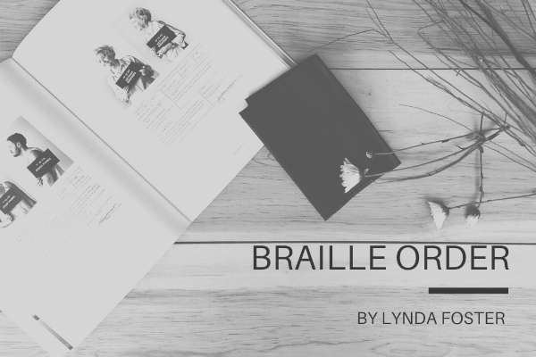

# BrailleOrder

Braille transcribers are required to sort a list of symbols into braille order for the "Special Symbols Page" in each book. It is a tedious task which is done by hand using the following reference chart. Note: ASCII-braille is viewed as braille fonts in braille transcription programs.*

This web application will allow a braillist to paste their list of special symbols (groups of ASCII characters) and rearrange the list into braille order at the click of a button. 

# Other Features
- Alert for when a symbol includes a character that is not ASCII Braille 
- Alert when a symbol is not required to be included in the Special Symbols Page.
- Alert that a symbol is not in the Known Symbols database as scraped from http://www.iceb.org/symbsc2.html
  - an option to request the alerted symbol be added to the "known symbols" database.
- Option to report an incorrect symbol or other issue.
- Issue tracking, user proposed-fixes.
- User-proposed additions to the database of "known symbols"

\* characters without braille font: abcdefghijklmnopqrstuvxyz&=(!)*<%?:$]\\[w1234567890/+#>'-@^_\".;,"
